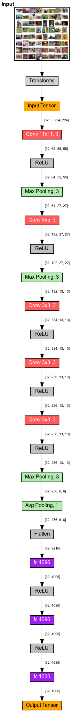

# AlexNet (2012)

- **Framework:** TensorFlow
- **Dataset:** Cats-Dogs (https://www.kaggle.com/datasets/chetankv/dogs-cats-images)
- **Paper Link:** https://paperswithcode.com/model/alexnet

- AlexNet has the same concept as the LeNet5, but there are a lot of extra convs.
- They used ReLU for the activation function and uses MaxPooling for downsampling
- Here we are working with images of 224x224 which is much high compared to 32x32 of the LeNet5.
- Dropout layer and Data Augmentation to avoid overfitting
- Local Response Normalization (similar to Batch Normalization, today) to speed up the training time
- Weight Regularization (L2) to avoid overfitting
