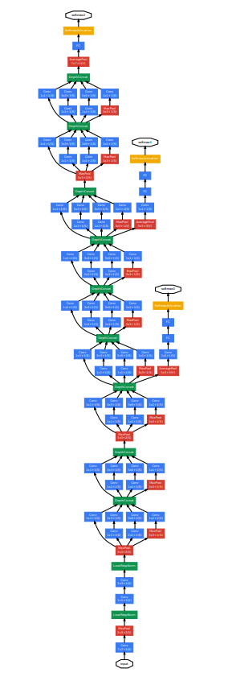
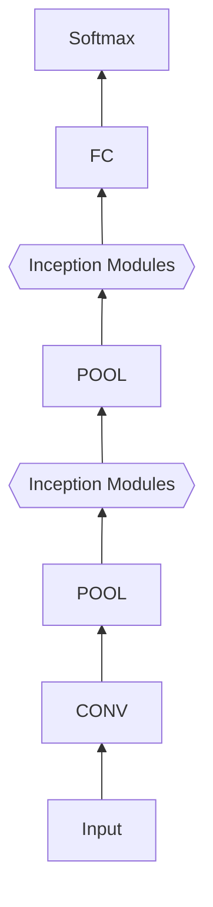
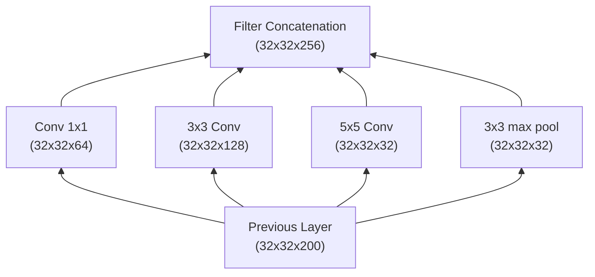
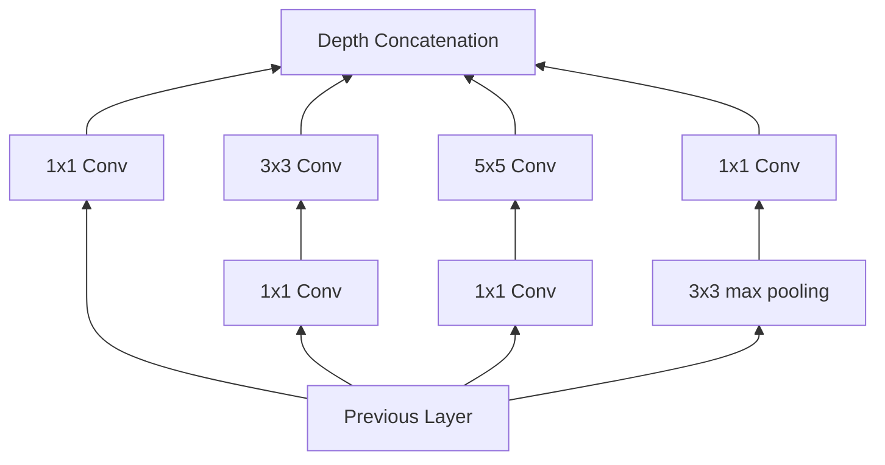

# GoogLeNet (2014)

- **Framework:** TensorFlow
- **Dataset:** Cats-Dogs (https://www.kaggle.com/datasets/chetankv/dogs-cats-images)
- **Paper Link:** https://paperswithcode.com/model/googlenet



- The main goal is to have a deeply neural network and improve the computation inside it.
- Basically they created o module called `inception module` and this module will apply different sizes of filters (`5x5`, `3x3`, `1x1` and `max-pooling`) this avoids the fact to have to choose which is the better.



## Inception Module

- `1x1` Conv layer
- `3x3` Conv layer
- `5x5` Conv layer
- `3x3` Max-Pooling layer

The outputs of each layer are concatenated into a single output



- In reality, we need to use `conv1x1` to decrease the quantity of parameters before the `conv3x3` and `conv5x5`. Off course, we need to use after the `3x3 max pool` because the max pool doesn't decrease the depth. Then, the true representation is:



- Comparation:

```
model: "inception: without conv 1x1"
__________________________________________________________________________________________________
 Layer (type)                   Output Shape         Param #     Connected to                     
==================================================================================================
 input_30 (InputLayer)          [(None, 32, 32, 200  0           []                               
                                )]                                                                
                                                                                                  
 conv1 (Conv2D)                 (None, 32, 32, 64)   12864       ['input_30[0][0]']               
                                                                                                  
 conv3 (Conv2D)                 (None, 32, 32, 128)  230528      ['input_30[0][0]']               
                                                                                                  
 conv5 (Conv2D)                 (None, 32, 32, 32)   160032      ['input_30[0][0]']               
                                                                                                  
 MaxPool (MaxPooling2D)         (None, 32, 32, 200)  0           ['input_30[0][0]']               
                                                                                                  
 concatenate_6 (Concatenate)    (None, 32, 32, 424)  0           ['conv1[0][0]',                  
                                                                  'conv3[0][0]',                  
                                                                  'conv5[0][0]',                  
                                                                  'MaxPool[0][0]']                
                                                                                                  
==================================================================================================
Total params: 403,424
Trainable params: 403,424
Non-trainable params: 0
__________________________________________________________________________________________________
```

```
Model: "Inception: with conv 1x1"
__________________________________________________________________________________________________
 Layer (type)                   Output Shape         Param #     Connected to                     
==================================================================================================
 input_32 (InputLayer)          [(None, 32, 32, 200  0           []                               
                                )]                                                                
                                                                                                  
 conv2d_17 (Conv2D)             (None, 32, 32, 32)   6432        ['input_32[0][0]']               
                                                                                                  
 conv2d_18 (Conv2D)             (None, 32, 32, 32)   6432        ['input_32[0][0]']               
                                                                                                  
 MaxPool (MaxPooling2D)         (None, 32, 32, 200)  0           ['input_32[0][0]']               
                                                                                                  
 conv1 (Conv2D)                 (None, 32, 32, 64)   12864       ['input_32[0][0]']               
                                                                                                  
 conv3 (Conv2D)                 (None, 32, 32, 128)  36992       ['conv2d_17[0][0]']              
                                                                                                  
 conv5 (Conv2D)                 (None, 32, 32, 32)   25632       ['conv2d_18[0][0]']              
                                                                                                  
 conv2d_19 (Conv2D)             (None, 32, 32, 32)   6432        ['MaxPool[0][0]']                
                                                                                                  
 concatenate_8 (Concatenate)    (None, 32, 32, 256)  0           ['conv1[0][0]',                  
                                                                  'conv3[0][0]',                  
                                                                  'conv5[0][0]',                  
                                                                  'conv2d_19[0][0]']              
                                                                                                  
==================================================================================================
Total params: 94,784
Trainable params: 94,784
Non-trainable params: 0
__________________________________________________________________________________________________
```

- We have three parts of the GoogLeNet model:
  - **Part I:** Conv and max pooling like the AlexNet and LeNet
  - **Part II:** Inceptions blocks separated by `3x3 max pooling`
  - **Part III:** The Classifier (FC &rarr; Softmax)

- In the architecture have three different outputs using softmax only for training to avoid the gradient vanish (because the deeply) and increase the training speed. The final model uses only the last one to make the predictions.