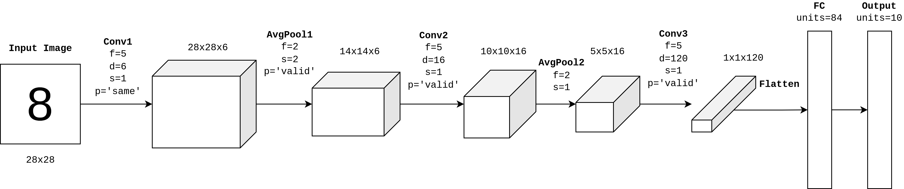

- **Framework:** PyTorch
- **Dataset:** MNIST
- **Paper:** http://yann.lecun.com/exdb/publis/pdf/lecun-01a.pdf

# LetNet5 (1998)

- This was the first implementation of convolutional neural networks for computer vision. We have a simple neural network with 5 convs (because we have the name LeNet5).
- They used the activation function `tanh` for the neurons, and today we have the `ReLU` and its variants. Some advantages of `ReLU` is avoiding the vanish gradient problem, more speed to training, and decreasing overfitting.
- The LeNet5 has used `avgpooling` for downsampling, and today we use `maxpooling` which performs better
- As you can see, this network is limited for high resolution images because we have few convolutional layers (not deeply) to be able to train in 1998 when we didn't have many computer resources
- It was the pioneer in the field and very important to SOTA today.
