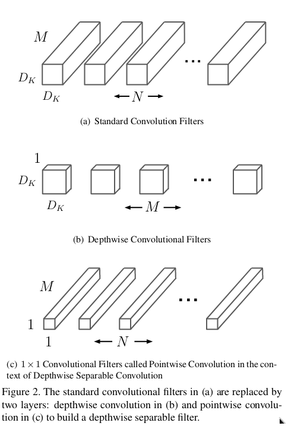

# MobileNet v1 (2017)

- **Framework:** TensorFlow
- **Dataset:** Cats-Dogs (https://www.kaggle.com/datasets/chetankv/dogs-cats-images)
- **Paper Link:** https://paperswithcode.com/paper/mobilenets-efficient-convolutional-neural


- The MobileNet is designed for application in Deep Learning which needs low latency and high accuracy. Some examples are: robotics, self-driving car, and augmented reality.
- The main core of MobileNet is to use **Depthwise Separable Convolution**, which is a light convolution.



- Given an input with size ($D_F$, $D_F$, $M$) e kernel size ($D_K$, $D_K$, $N$). Then, we have for the *Standard Convolutions Cost*: $D_K \times D_K \times \times M \times N \times D_F \times D_F$
- Considering the **depthwise separable convolution** we have two parts:
  - **Depthwise Convolution:** for each input filter we have one filter to make the sliding. Then, we have the following cost: $D_K \times D_K \times D_F \times D_F \times M$. But, they don't get the relation between the depth M.
  - **Pointwise Convolution:** we perform a convolutional $1 \times 1 \times N$ on the output $D_F \times D_F \times M$ stacked using the Depthwise Convolution, and we get a computational cost of $D_F \times D_F \times M \times N$. With this we have a linear relationship between the outputs.
- We can compute the reduced cost by:

$$ \frac{\text{Depthwise Separable Conv}}{\text{Standard Conv Cost}} = \frac{D_K \times D_K \times D_F \times D_F \times M + D_F \times D_F \times M \times N}{D_F \times D_F \times M \times N \times D_K \times D_K} = \frac{1}{N} + \frac{1}{D_K^2}$$

- Reducing of parameters comparation:
  
```
Model: "Standard Conv"
_________________________________________________________________
 Layer (type)                Output Shape              Param #   
=================================================================
 input_2 (InputLayer)        [(None, 32, 32, 32)]      0         
                                                                 
 conv1 (Conv2D)              (None, 32, 32, 64)        18496     
                                                                 
=================================================================
Total params: 18,496
Trainable params: 18,496
Non-trainable params: 0
_________________________________________________________________
```

```
Model: "Depthwise Separable Convolution"
_________________________________________________________________
 Layer (type)                Output Shape              Param #   
=================================================================
 input_13 (InputLayer)       [(None, 32, 32, 32)]      0         
                                                                 
 depthwise_conv2d_8 (Depthwi  (None, 32, 32, 32)       320       
 seConv2D)                                                       
                                                                 
 Pointwise_Conv (Conv2D)     (None, 32, 32, 64)        2112      
                                                                 
=================================================================
Total params: 2,432
Trainable params: 2,432
Non-trainable params: 0
_________________________________________________________________
```

- They created two hyperparameters for your network:
  - **Width Multiplier: Thinner Models ($\alpha$):** the main objective is create smaller and less computationally expensive models $D_K \times D_K \times \alpha M \times D_F \times D_F + \alpha M \times \alpha N \times D_F \times D_F$
  - **Resolution Multiplier: Reduced Representation ($\rho$):** setting the input resolution in order to reduce cost of a neural network $D_K \times D_K \times \alpha M \times \rho D_F \times \rho D_F + \alpha M \times \alpha N \times \rho D_F \times \rho D_F$