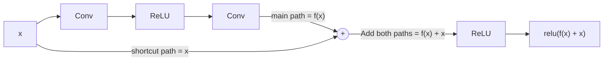
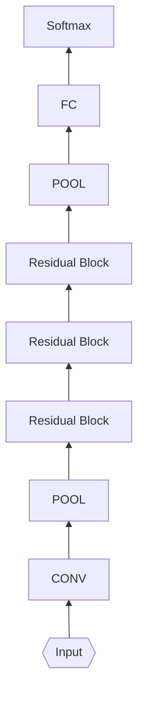
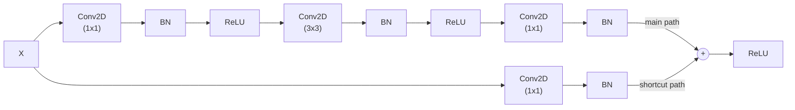

# ResNet (2015)

- **Framework:** TensorFlow
- **Dataset:** Cats-Dogs (https://www.kaggle.com/datasets/chetankv/dogs-cats-images)
- **Paper Link:** https://paperswithcode.com/model/resnet

- They introduced a novel `residual module` architecture with "skip connections", this connection allows the gradient to be directly backpropagated to early layers and avoid the vanishing gradient problem. In addition, it allows the model to learn an identity function, which ensures that the layer will perform at least as well as the previous layers.

- We sum up before the activation function (ReLU)
- The combination of these sum is called `residual block` and we have the following pattern:

- As we can see the first part is the feature extraction. They used Conv + Pool followed by residual blocks becoming very deep neural networks. After the feature extraction they used fully connected layers for the classifier

## Residual Block

- The main path uses 3 conv layers of sizes: 1x1, 3x3, and 1x1 followed by batch normalization
- The shortcut path can be:
  - Regular shortcut - add the input dimensions to the main path
  - Reduce shortcut - add a conv layer in the shorcut path before merging with the main path (in this case we set up a stride parameter)

- In residual block doesn't have pooling layers to decrease the shape (height, weight), instead of we use conv with stride to decrease.