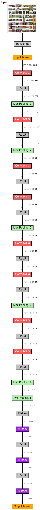

# VGG (2014)

- **Framework:** TensorFlow
- **Dataset:** Cat x Dog (https://www.kaggle.com/datasets/chetankv/dogs-cats-images)
- **Paper Link:** https://paperswithcode.com/model/vgg



- Try to reduce the number of hyperparameters that LeNet5 and AlexNet have. For that they used the following pattern:
  - All convolutional layers are 3x3 kernel-sized filters with a strides value of 1 and padding value of same
  - All pooling layers have a 2x2 pool size and a strides value of 2
- The key idea of using small convs is that the receptive field larger (7x7, for example) is more expansive than multiple stacked layers of small filters (3x3), which reduce the number of parameters. For a filter of 7x7 we got:

$$ \#parameters_{(7\times7)} = 7 \times 7 \times C \times K + C$$

for a filter of 3x3 we have:

$$ \#parameters_{(3\times3)} = 3 \times C \times K + 2 \times 3 \times 3 \times C^2 + 3 \times C$$

- For the example above we are considering the input filter of $K$. If $K \geq C$ we have less parameters for the full-stacked convolution. On example below the input filters is $K = C$


```
_________________________________________________________________
 Layer (type)                Output Shape              Param #   
=================================================================
 conv2d (Conv2D)             (None, 28, 28, 32)        9248      
                                                                 
 conv2d_1 (Conv2D)           (None, 28, 28, 32)        9248      
                                                                 
 conv2d_2 (Conv2D)           (None, 28, 28, 32)        9248      
                                                                 
=================================================================
Total params: 27,744
Trainable params: 27,744
Non-trainable params: 0
_________________________________________________________________
Model: "sequential_1"
_________________________________________________________________
 Layer (type)                Output Shape              Param #   
=================================================================
 conv2d_3 (Conv2D)           (None, 28, 28, 32)        50208     
                                                                 
=================================================================
Total params: 50,208
Trainable params: 50,208
Non-trainable params: 0
_________________________________________________________________
```

