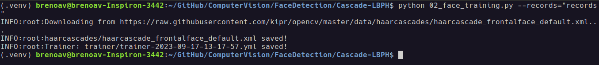

# Cascade Classifier

An application that records images, trains an algorithm for recognition of different faces registered, and detect in real time the face using a [Cascade Classifier](https://docs.opencv.org/3.4/db/d28/tutorial_cascade_classifier.html) and [LBPH Algorithm](https://towardsdatascience.com/face-recognition-how-lbph-works-90ec258c3d6b). 

# Dependencies

- Create a [virtual environment](https://virtualenv.pypa.io/en/latest/), activate, and 
install the required libraries:

```console
$ python -m venv .venv
$ source .venv/bin/activate # Unix
$ pip install opencv-contrib-python requests
```

# How to use

## Registering Faces

- To register new faces, run the script [01_face_registration.py](./01_face_registration.py):

```console
$ python 01_face_registration.py --records="records" --id=1 --name="breno"
```

- Press 't' to record an image (record more than one image). Press 'q' to exit. This will create the following structured :file_folder: :

```
Cascade-LBPH/
├─ records/
│  ├─ 001/
│  │  ├─ img1.png
│  │  ├─ ...
│  ├─ id-name.json
```

- If the folder already exists, this will append the new ID in the folder

- **NOTE:** You need to close the application and rerun if you want to record another face (different ID)


## Training the recognizer

- After saving the faces, it's time to train the recognizer with each ID using the images saved before [02_face_training.py](./02_face_training.py).

```console
$ python 02_face_training.py --records="records"
```



- In this step, will create two files: one for locate face (`haarcascades/haarcascade_frontalface_default.xml`) and the other one is the weights trained of the LBPH algorithm (`trainer/trainer-YY-MM-DD-HH-MM-SS.yml`)

## Real-time detection

- Finally, it's time to detect the face and recognizer using the webcam in real-time with the code [03_face_detection.py](./03_face_detection.py)

```console
$  python 03_face_detection.py --records="records" --detector_filepath="haarcascades/haarcascade_frontalface_default.xml" --recognizer_filepath="trainer/trainer-2023-09-17-13-17-57.yml"
```

