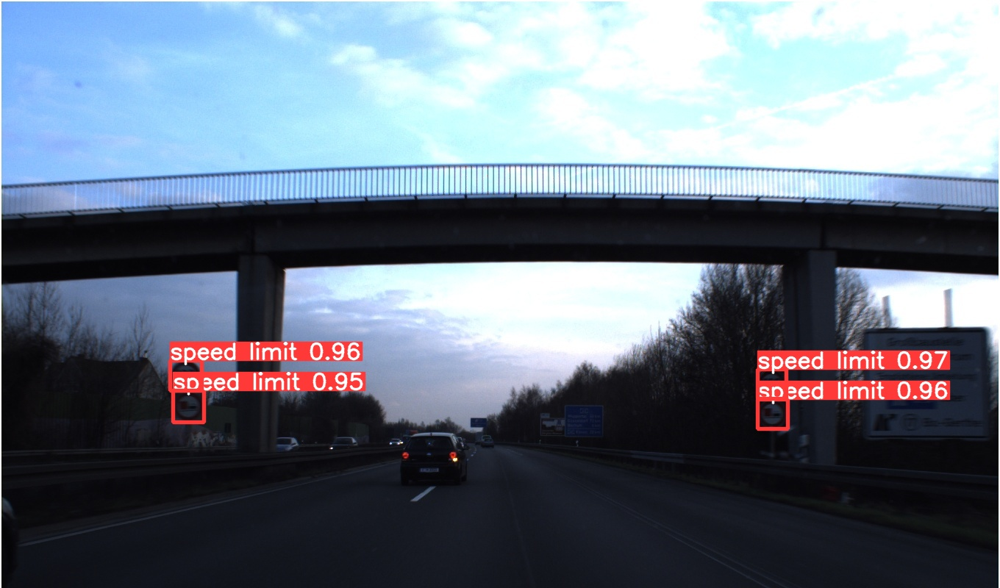

# YOLO-v5

This is a demo for testing the [YOLO-v5](https://github.com/ultralytics/yolov5) implementation in PyTorch from Ultralytics. I used the [Train Custom Data](https://docs.ultralytics.com/yolov5/train_custom_data) and the video [Yolo v5 on Custom Dataset | Train and Test Yolov5 on Custom Dataset - Code With Aarohi](https://www.youtube.com/watch?v=80Q3HIBy7Qg)



- Link for the dataset used: [Traffic Signs Dataset in YOLO format](https://www.kaggle.com/datasets/valentynsichkar/traffic-signs-dataset-in-yolo-format). You need to login into Kaggle and download the files.

# Setup

- The [setup.sh](./setup.sh) script takes a clone and copies the folder [scripts/](./scripts/) to the `yolov5` folder when finished the clone.
- The script [scripts/split_train_val.py](./scripts/split_train_val.py) is used if you want to split the unique folder dataset (if you have the images + annotations together)
- You can find the structure of the directories in the tutorials at the beginning of the README

# Commands

Depends on your setup for adjusting the paths!

## Training

```bash
python train.py --img 415 --batch 16 --epochs 30 --data dataset.yaml --weights yolov5s.pt --cache
```

## Detecting

```bash
python detect.py --source datasets/traffic-light/images/val/00367.jpg --weights runs/train/exp3/weights/best.pt
```
