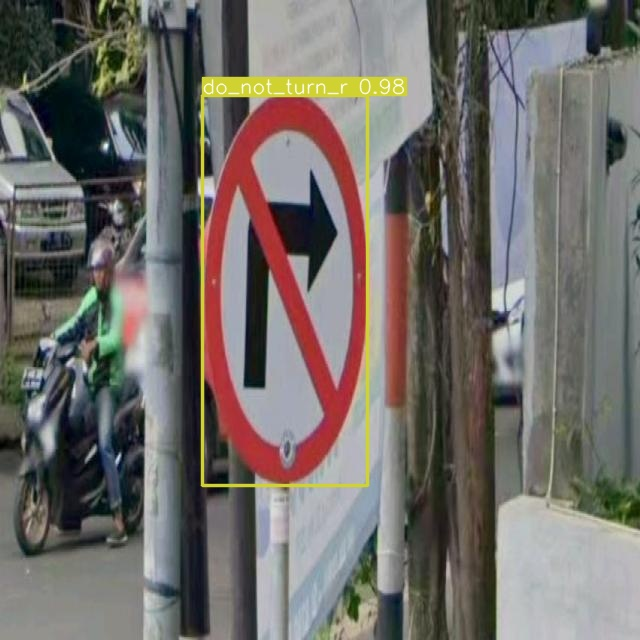
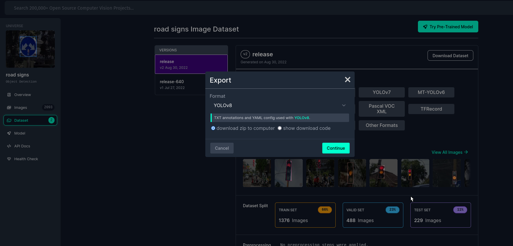
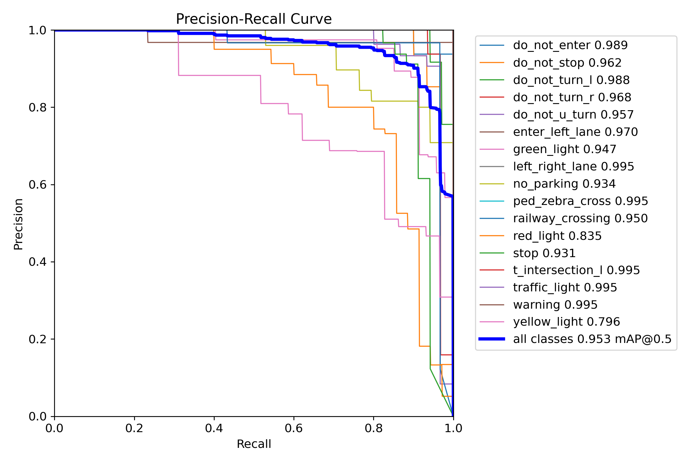
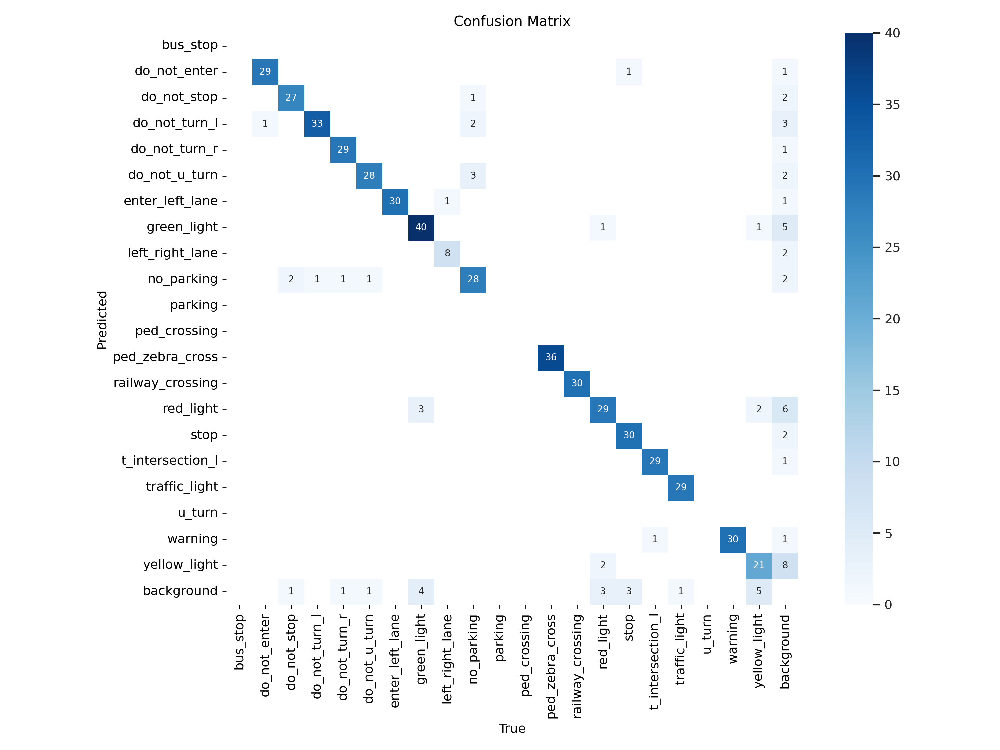

# YOLOv8 Object Detection

A simple showcase of how we can train a [YOLOv8](https://github.com/ultralytics/ultralytics) for Object Detection, it's a straightforward library.

| Pred 1 | Pred 2 |
|:-: |:-:|
| | 

## Dataset

I go to [https://universe.roboflow.com/roboflow-100/road-signs-6ih4y](https://universe.roboflow.com/roboflow-100/road-signs-6ih4y) and download the dataset choosing the YOLOv8 text annotation as shown below:



## Dependencies

Create a virtual environment, I'm using [virtualenv](https://virtualenv.pypa.io/en/latest/user_guide.html). Install [ultralytics](https://github.com/ultralytics/ultralytics) using pip. Note: this will install the PyTorch version recommended too.

```console
$ python -m venv .venv
$ source .venv/bin/activate # Unix
$ pip install ultralytics jupyter Pillow matplotlib
```

## Training and Validation

You can find all the training, validation, and testing tasks on the notebook: [TrainingYoloV8.ipynb](./YoloV8forDetection.ipynb)

## Metrics Results





## Testing

On the same notebook [TrainingYoloV8.ipynb](./YoloV8forDetection.ipynb) you can see at the end the predictions using the test dataset. The snippet of the code:


```python
model = YOLO("run/train2/weights/best.pt")
plt.figure(figsize=(14, 80))
for i, img_file in enumerate(glob(os.path.join(TEST_IMAGES_DATASET_PATH, "*.jpg"))[:60], start=1):
    plt.subplot(20, 3, i)
    results = model.predict(source=img_file, 
                            save=True, 
                            project=os.path.join(os.getcwd(), "run", "predict"), 
                            verbose=False)

    # Obtain the path of the file saved
    filepath = os.path.join(results[0].save_dir, os.path.basename(results[0].path))
    im_res = Image.open(filepath)
    plt.imshow(im_res)
```