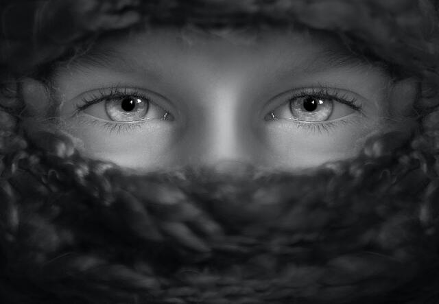

# Computer Vision

This repository aims to be a local to store my studies in Computer Vision. I will explain the concepts in my vision and apply them to code. My objective is to understand and document the main components of the applications in different fields: classification, object detection, object segmentation, and generative adversarial networks.

## Classification

- [LeNet5](Classification/ClassicNetworks/LeNet5/)
- [AlexNet](Classification/ClassicNetworks/AlexNet/)
- [VGG16](Classification/ClassicNetworks/VGG16/)
- [GoogleLeNet](Classification/ClassicNetworks/GoogLeNet/)
- [ResNet](Classification/ClassicNetworks/ResNet/)
- [MobileNet](Classification/ClassicNetworks/MobileNet/)

## Object Detection

- [R-CNN “handcrafting”](ObjectDetection/R-CNN-Hand-Crafting/)
- [Object Detection API (TF)](ObjectDetection/Object-Detection-API-TF/)
- [YOLOv5 (PyTorch)](ObjectDetection/YOLOv5/)
- [YOLOv8 (Ultralytics)](ObjectDetection/YOLOv8/)

## Face Recognition

- [Cascade-LBPH](FaceDetection/Cascade-LBPH/) :new: